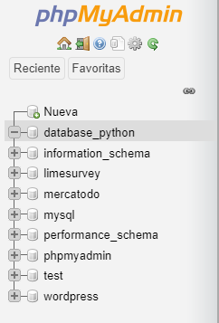
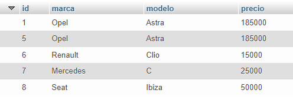

# MySQL con Python
## Emmanuel Cruz Hernández

----

#### Descripción

Manejo de bases de datos con MySQL en Python.

---- 

## Sobre MySQL

MySQL es otro manejador de bases de datos que se puede manejar con Python, entre otras funciones. Para instalar el módulo, se requiere instalar Xampp o Wampserver. 

El módulo para manejar MySQL con Python también se debe descargar con la siguiente instrucción:

        pip install mysql-connector-python

Para hacer uso del módulo, se importa con la instrucción siguiente

        import mysql

En particular, se va a utilizar el conector de mysql, por lo que también podríamos importar de la siguiente manera

        import mysql.connector

Para la creación de la base de datos, se utiliza la función _connect_, que está implementada para un connector. Este recibe algunos parámetros
* host: el host donde se va a conectar la base de datos. Para proyectos locales es _localhost_
* user: el nombre de usuario, que por default, es _root_.
* password: la contraseña hacia la base, por default es una cadena vacía.
* database: una referencia a la base de datos asociada.

Es importante mencionar que el último parámetro puede no pasarse, ya que la base de datos se puede crear directamente desde Python.

### Crear una base de datos

Para crear una base de datos se utiliza la función _execute_, implementado para un **cursor** que recibe como parámetro una cadena con la instrucción en SQL de la consulta que se quiere realizar. En particular, para crear una base de datos

        cursor = database.cursor()
        cursor.execute("CREATE DATABASE IF NOT EXISTS databaseName")

Notése que una vez ejecutado el programa, se mostrará la nueva base creada en _phpMyAdmin_.

Perfectly balanced

### Crear una tabla

Para crear una tabla nuevamente se utiliza la función _execute_, son la instrucción en SQL para la creación de una tabla. Por ejemplo, si quiero crear una tabla de vehículos, lo puedo hacer de la siguiente forma, utilizando el cursor.

        cursor.execute("""
            CREATE TABLE IF NOT EXISTS vehiculos(
                id int(10) auto_increment not null,
                marca varchar(40) not null,
                modelo varchar(40) not null,
                precio float(10.2) not null,
                CONSTRAINT pk_vehiculo PRIMARY KEY (id)
            )
        """)

**NOTA**: Esta sintaxis también es válida para [SQLite](https://github.com/EmmanuelCruz/SQL-Python/tree/master/SQLite).

Si se corre el programa, podemos notar que en _phpMyAdmin_ ya se encuentra creada la tabla en la base de datos.

### Insertar un nuevo dato

Se utiliza la función _execute_ con la instrucción en SQL sobre lo que se quiere hacer. Para insertar un nuevo elemento se usa lo siguiente:

                cursor.execute("INSERT INTO tableName VALUES (...)")
                database.commit()

Donde _tableName_ es el nombre de la tabla y los tres puntos corresponde a los parámetros del nuevo objeto a insertar.

Por otro lado, también es posible insertar elementos de forma masiva, es decir, más de uno en una sola instrucción. Esto se hace con la siguiente sintaxis

                cursor.execute("INSERT INTO tableName VALUES (%s,%s,%s,...)", datos)
                database.commit()

donde _%s_ significa que ahí estará uno de los datos de los elementos a insertar. Nótese que esta nueva forma recibe un parámetro, que corresponde a una lista de tuplas con la información de los datos a almacenar.

**IMPORTANTE**: Siempre es necesario invocar la función _commit_ para que los cambios se vean reflejados en la base, de lo contrario, estos no estarán visibles.

Perfectly balanced

### Acceder a los elementos de una tabla

Con ayuda de la función _execute_ se puede escribir una consulta a una de las tablas que esté en la base de datos. 

                cursor.execute("SELECT * FROM tableName")

Por otra parte, también se pueden obtener elementos específicos de la tabla

                cursor.execute("SELECT val1, val2, ... FROM tableName")

Ahora, esta consulta se debe guardar en algún lado. Se queda vagando en la memoria hasta que se invoca la función _fetchall_ o _fectone_ para obtener todos los elementos o solo el primero, respectivamente.

                result = cursor.fetchall()
                result = cursor.fetchone()

### Eliminar elementos

Para eliminar nuevamente se utiliza _execute_ con la expresión de eliminación SQL.

                cursor.execute("DELETE FROM tableName WHERE val = '---'")
                database.commit()

Donde _val_ es el atributo donde se quieren encontrar coindicencias y _---_ corresponde al valor concreto de los elementos que cumplan con ese valor.

**IMPORTANTE**: Los datos serán reflejados, después de hacer commit a la base de datos.

### Actualizar

Finalmente, para actualizar los datos, se utiliza la expresión de actualización de SQL como parámetro en la función _execute_.

                cursor.execute("UPDATE tableName SET val='NewValue' WHERE val = 'OldValue'")
                database.commit()

**IMPORTANTE**: después de realizar la operación, se debe invocar la función commit para guardar los cambios en la base de datos.